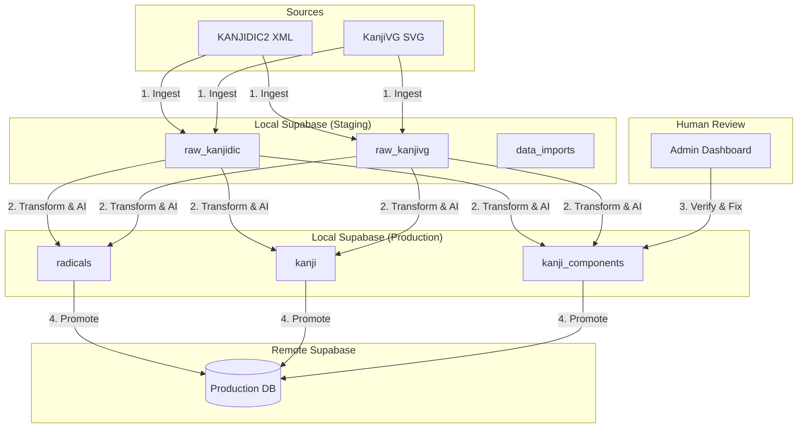

# Content Pipeline Orchestration

## Overview

The Content Pipeline transforms raw open-source dictionary data (KANJIDIC2, KanjiVG) into structured, verified educational content used by the app. It follows a **Local-First, Human-in-the-Loop** architecture.

The pipeline runs entirely in the **Local Environment** (Local Supabase + Admin Tool). Only verified, production-ready data is synced to the **Remote Production** database.

## Architecture



## Phase 1: Ingestion (Raw Staging)

**Goal:** Load external file data into queryable SQL tables without data loss.

### 1.1 Version Tracking

Before parsing, create a new `data_imports` row to track this batch.

| Field | Value |
|---|---|
| `source` | `kanjidic` or `kanjivg` |
| `source_version` | e.g. "2024-04-01" |
| `status` | `pending` |

See [data_import.md](../entities/data_import.md).

### 1.2 Parsing & Insertion

Python scripts parse source files and insert rows into `raw_kanjidic` / `raw_kanjivg`.

- Every row carries the `import_id` from step 1.1.
- **Conflict strategy:** Insert new rows under the new `import_id`. Old import versions are preserved for diffing.
- On success: set `data_imports.status` = `ingested`, populate `record_count`.
- On failure: set `status` = `failed`, populate `error_message`.

See [raw_kanjidic.md](../entities/raw_kanjidic.md), [raw_kanjivg.md](../entities/raw_kanjivg.md).

## Phase 2: Transformation (Raw → Local Production)

**Goal:** Convert raw dictionary data into app entities (Radical, Kanji, KanjiComponent).

### 2.1 The Processor

A Dart/SQL logic layer (triggered via Admin Tool) processes the active `import_id`. Set `data_imports.status` = `processing`.

### 2.2 Radical Extraction

1. Query unique `element` attributes from `raw_kanjivg.components`.
2. Upsert into `radicals` table.
3. Parse `position` and `variant`/`original` attributes to populate `radical_variants`.

See [radical.md](../entities/radical.md).

### 2.3 Kanji & Component Composition

1. **Kanji creation:** Upsert `kanji` rows using metadata from `raw_kanjidic` (stroke count, grade, frequency, JLPT mapping).
2. **Component linking:** Recursively parse `raw_kanjivg.components` tree.
   - Stop recursion when a node matches a known `radicals.master_symbol`.
   - Create `kanji_components` rows.

See [kanji.md](../entities/kanji.md), [kanji_component.md](../entities/kanji_component.md).

### 2.4 AI Heuristics (Logic Hint Estimation)

For every new `KanjiComponent`, the system estimates `logic_hint` (semantic vs phonetic).

**Algorithm — Onyomi Matching:**

1. Fetch onyomi for the kanji (e.g. 忙 = ボウ).
2. Look up the radical's `master_symbol` as a character in `raw_kanjidic` to get its onyomi (e.g. 亡 = ボウ, モウ). Radicals don't store readings directly (see [radical.md](../entities/radical.md) rule #5).
3. If match → set `logic_hint = phonetic`, `verification_status = draft`.
4. If no match → set `logic_hint = semantic`, `verification_status = draft`.

All new components start as `draft` regardless of confidence. The `ai_confidence` score (0.0–1.0) helps prioritize the review queue — lowest confidence first.

On completion: set `data_imports.status` = `processed`, populate `processed_at`.

## Phase 3: Verification (Human-in-the-Loop)

**Goal:** Ensure AI guesses and raw data errors do not reach end users.

### 3.1 Verification Status

Entities that require human review (specifically `KanjiComponent`) track their state:

| Status | Description |
|---|---|
| `draft` | Newly generated by the transformation layer. Not ready for remote sync |
| `verified` | Confirmed by human review (or high-confidence auto-rule). Ready for remote sync |
| `flagged` | Identified as problematic/error. Excluded from sync |

See `verification_status` field in [kanji_component.md](../entities/kanji_component.md).

### 3.2 Review Queue (Admin Dashboard)

The Admin Tool queries `kanji_components WHERE verification_status = 'draft'`, ordered by `ai_confidence ASC` (least confident first).

**Review UI:**
- Visual diff: kanji and component shown side-by-side.
- Reading comparison: radical onyomi vs kanji onyomi displayed for phonetic verification.
- Actions: "Confirm Phonetic", "Switch to Semantic", "Flag for Review", "Mark Verified".

### 3.3 Batch Verification

High-confidence matches (e.g. `ai_confidence >= 0.95`) can be auto-verified in bulk via an admin action, reducing manual review volume. The threshold is configurable.

## Phase 4: Remote Sync (Promotion)

**Goal:** Push only verified, stable content to the Remote Production database.

### 4.1 Sync Strategy

- **Direction:** One-way (Local → Remote).
- **Method:** Incremental upsert.
- **Safety gate:** `WHERE verification_status = 'verified'` for tables that have it (currently `kanji_components`). Other content tables sync all rows.

### 4.2 Sync Order (FK Dependency Resolution)

Tables must be synced in strict order to satisfy foreign key constraints:

1. **radicals** — root entities (includes `radical_i18n`, `radical_variants`)
2. **kanji** — depends on nothing directly (includes `kanji_i18n`, `kanji_readings`)
3. **kanji_components** — depends on both `radicals` and `kanji`
4. **vocabulary** — depends on `kanji` (includes `vocabulary_i18n`, `vocabulary_readings`, `vocabulary_kanji`)

Sync will fail if a parent radical or kanji is missing on remote. The sync script validates parent existence before upserting children.

### 4.3 Post-Sync Actions

1. Set `data_imports.status` = `promoted`, populate `promoted_at`.
2. Remote app clients receive updates via their standard sync mechanism (see [offline.md](offline.md)).

## Pipeline Status Lifecycle

```
pending → ingested → processing → processed → promoted
   ↓         ↓           ↓            ↓
 failed    failed      failed      failed
```

Each transition updates the corresponding timestamp on `data_imports`. See [data_import.md](../entities/data_import.md) for the full status enum.

## Commands

```bash
# Phase 1: Ingest raw data into local Supabase
python scripts/ingest_kanjidic.py --version "2024-363"
python scripts/ingest_kanjivg.py --version "2024-04-01"

# Phase 2: Run transformation (via Admin Tool or CLI)
# Triggered from Admin Dashboard UI

# Phase 3: Review
# Done interactively via Admin Dashboard

# Phase 4: Promote to remote
# Triggered from Admin Dashboard after review is complete
```

## Related Docs

- [data_import.md](../entities/data_import.md) — import tracking entity
- [raw_kanjidic.md](../entities/raw_kanjidic.md) — KANJIDIC2 staging table
- [raw_kanjivg.md](../entities/raw_kanjivg.md) — KanjiVG staging table
- [kanji_component.md](../entities/kanji_component.md) — verification_status and ai_confidence fields
- [radical.md](../entities/radical.md) — radical extraction target
- [kanji.md](../entities/kanji.md) — kanji creation target
- [offline.md](offline.md) — client-side sync after promotion
- [supabase.md](supabase.md) — database infrastructure
