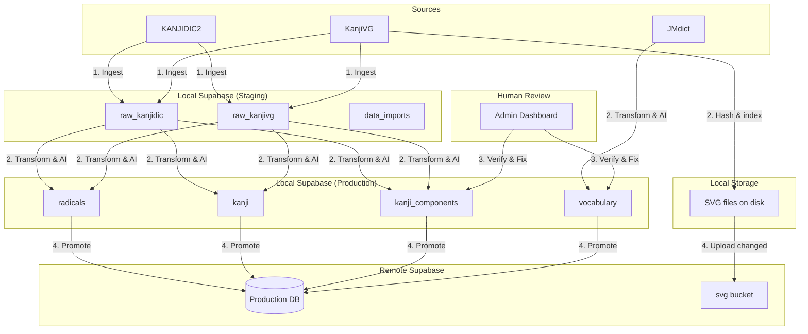

# Content Pipeline Orchestration

## Overview

The Content Pipeline transforms raw open-source dictionary data (KANJIDIC2, KanjiVG, JMdict) into structured, verified educational content used by the app. It follows a **Local-First, Human-in-the-Loop** architecture.

The pipeline runs entirely in the **Local Environment** (Local Supabase + Admin Tool). Only verified, production-ready data is synced to the **Remote Production** database.

## Source Archives

Immutable source data lives in `sources/` at the project root. Each folder is a versioned snapshot — never modified after download.

### 1. Kanji Source (Official XML) — `kanjidic-{date}/`

Downloaded from the [EDRDG](http://www.edrdg.org/wiki/index.php/KANJIDIC_Project) project. The official KANJIDIC2 XML contains every field (meanings in all languages, classical radicals, nanori, variants, dictionary refs) in a single file.

| Archive | Contents | Pipeline target |
|---|---|---|
| `kanjidic2.xml.gz` | Full KANJIDIC2 dictionary (~13,000 entries) | `raw_kanjidic` → `kanji`, `kanji_i18n`, `kanji_readings` |

Single-pass ingestion: meanings are grouped by `m_lang` attribute (EN, ES, FR, etc.) into the `raw_kanjidic.meanings` JSONB column.

### 2. Vocabulary Source (Yomichan JSON) — `jmdict-{version}/`

Downloaded from [yomidevs](https://github.com/yomidevs). Vocabulary entries in Yomichan-compatible JSON bank format. Two files are needed for the two-pass merge strategy.

| Archive | Contents | Pipeline target |
|---|---|---|
| `JMdict_english_with_examples.zip` | English vocabulary entries + example sentences | `vocabulary`, `vocabulary_i18n` (en), `vocabulary_sentences` (en) |
| `JMdict_spanish.zip` | Spanish vocabulary entries | `vocabulary_i18n` (es) |

### 3. Visual Source (KanjiVG) — `kanjivg-{version}/`

Downloaded from the [KanjiVG](https://kanjivg.tagaini.net/) project. Stroke order and component decomposition data.

| Archive | Contents | Pipeline target |
|---|---|---|
| `kanjivg-{version}.xml.gz` | Single XML with all kanji stroke/component data (~6,700 entries) | `raw_kanjivg` → `radicals`, `kanji_components` |
| `kanjivg-{version}-main.zip` | Individual SVG files per kanji (stroke diagrams) | `radicals` (SVG assets), `radical_variants` |

### Source Strategy Summary

| Source | Files | Languages | Strategy |
|---|---|---|---|
| Kanji | 1 XML (`kanjidic2.xml.gz`) | EN + ES + all | Single pass, meanings grouped by `m_lang` |
| Vocabulary | 2 JSON ZIPs | EN (+ sentences), ES | Two-pass merge by `ent_seq` |
| KanjiVG | 1 XML + 1 SVG ZIP | N/A | Single pass |

## Architecture



## Phase 1: Ingestion (Raw Staging)

**Goal:** Load external file data into queryable SQL tables without data loss.

### 1.1 Version Tracking

Before parsing, create a new `data_imports` row to track this batch.

| Field | Value |
|---|---|
| `source` | `kanjidic` or `kanjivg` |
| `source_version` | e.g. "2024-04-01" |
| `status` | `pending` |

See [data_import.md](../entities/data_import.md).

### 1.2 Parsing & Insertion

Dart parsers running inside the Admin Tool parse source files and insert rows into `raw_kanjidic` / `raw_kanjivg`.

- **Kanji (XML):** Single Dart pass on `kanjidic2.xml`. Groups all `<meaning>` tags by `m_lang` attribute into `raw_kanjidic.meanings` JSONB column (EN, ES, etc. in one pass). Gzip decompression via `dart:io` `GZipCodec`.
- **KanjiVG (XML):** Single Dart pass on `kanjivg-{version}.xml` for stroke paths and component trees. Gzip decompression via `dart:io` `GZipCodec`.
- **Vocabulary (JSON):** Two-pass merge (Phase 2.6). First ingest `JMdict_english_with_examples` to create rows, then ingest `JMdict_spanish` to update/inject Spanish definitions into `vocabulary_i18n`.

Common rules:
- Every row carries the `import_id` from step 1.1.
- **Conflict strategy:** Insert new rows under the new `import_id`. Old import versions are preserved for diffing.
- Batch insert in chunks of 500 rows via repository.
- On success: set `data_imports.status` = `ingested`, populate `record_count`.
- On failure: set `status` = `failed`, populate `error_message`.

See [raw_kanjidic.md](../entities/raw_kanjidic.md), [raw_kanjivg.md](../entities/raw_kanjivg.md).

## Phase 2: Transformation (Raw → Local Production)

**Goal:** Convert raw dictionary data into app entities (Radical, Kanji, KanjiComponent).

### 2.1 The Processor

A Dart/SQL logic layer (triggered via Admin Tool) processes the active `import_id`. Set `data_imports.status` = `processing`.

### 2.2 Radical Extraction

1. Query unique `element` attributes from `raw_kanjivg.components`.
2. Upsert into `radicals` table.
3. Parse `position` and `variant`/`original` attributes to populate `radical_variants`.

See [radical.md](../entities/radical.md).

### 2.3 Kanji & Component Composition

1. **Kanji creation:** Upsert `kanji` rows using metadata from `raw_kanjidic` (stroke count, grade, frequency, JLPT mapping). Spanish kanji meanings come from `raw_kanjidic.meanings['es']` (populated from the official XML in Phase 1), so no separate Spanish file is needed.
2. **Component linking:** Recursively parse `raw_kanjivg.components` tree.
   - Stop recursion when a node matches a known `radicals.master_symbol`.
   - Create `kanji_components` rows.

See [kanji.md](../entities/kanji.md), [kanji_component.md](../entities/kanji_component.md).

### 2.4 SVG Processing & Hashing

After radicals and kanji are created, the pipeline processes SVG files from the `kanjivg-{version}-main.zip` archive.

1. **Extract SVGs:** Unzip individual SVG files from the archive into a local working directory.
2. **Compute `svg_hash`:** For each SVG file, compute `SHA-256` of the raw file bytes and store the hex digest. This hash is content-based — identical SVG bytes always produce the same hash regardless of source version.
3. **Populate fields:** For each `radicals` and `radical_variants` row, set:
   - `svg_file_name` — Unicode hex filename, e.g. `06c34.svg` (see [supabase.md](supabase.md#file-naming))
   - `svg_hash` — the SHA-256 hex digest from step 2
   - `svg_file_url` — constructed from the bucket URL pattern: `{supabase_url}/storage/v1/object/public/svg/{svg_file_name}`
4. **Populate kanji SVGs:** Same process for `kanji` rows — each kanji has its own SVG from the same archive.

**Hash stability:** If a new KanjiVG version ships identical bytes for a given character, the hash stays the same. Only characters with actual SVG changes get a new hash. This enables efficient delta uploads during promotion (Phase 4).

### 2.5 AI Heuristics (Logic Hint Estimation)

For every new `KanjiComponent`, the system estimates `logic_hint` (semantic vs phonetic).

**Algorithm — Onyomi Matching:**

1. Fetch onyomi for the kanji (e.g. 忙 = ボウ).
2. Look up the radical's `master_symbol` as a character in `raw_kanjidic` to get its onyomi (e.g. 亡 = ボウ, モウ). Radicals don't store readings directly (see [radical.md](../entities/radical.md) rule #5).
3. If match → set `logic_hint = phonetic`, create a `kanji_component_reviews` row with `verification_status = draft`.
4. If no match → set `logic_hint = semantic`, create a `kanji_component_reviews` row with `verification_status = draft`.

All new components start with a `draft` review row regardless of confidence. The `ai_confidence` score (0.0–1.0) on the review row helps prioritize the review queue — lowest confidence first.

On completion: set `data_imports.status` = `processed`, populate `processed_at`.

### 2.6 Vocabulary Extraction (Two-Pass Merge)

JMdict data is processed separately from the KanjiVG/KANJIDIC pipeline using a two-pass merge strategy.

**Pass 1 (English Source):** Parse `JMdict_english_with_examples.zip`.
1. **Vocabulary creation:** Upsert `vocabulary` rows (word, reading, `ent_seq`, metadata).
2. **Localized meanings (EN):** Insert `vocabulary_i18n` with `lang_code='en'`.
3. **Readings:** Extract readings into `vocabulary_readings` with primary/secondary priority.
4. **Example sentences (English):** Extract sentence pairs (Japanese + English translation) into `vocabulary_sentences` with `verification_status = 'verified'` (source data is trustworthy).

**Pass 2 (Spanish Source):** Parse `JMdict_spanish.zip`.
1. **Match existing rows:** Find `vocabulary` row by `ent_seq`.
2. **Localized meanings (ES):** Insert `vocabulary_i18n` with `lang_code='es'`.
3. Does **not** touch `vocabulary_sentences` (no sentences in this file).

**After both passes:**
1. **Kanji association:** For each word, parse the string to find known kanji from the `kanji` table. Insert `vocabulary_kanji` rows with `kanji_id` and `position` (0-based index within the word).
2. **AI Translation (Spanish):** For each English sentence, use AI to generate a Spanish translation. Insert into `vocabulary_sentences` with `lang_code = 'es'` and `verification_status = 'draft'`. The AI model (local or API) is configured per environment.
3. **JLPT inference:** If JMdict provides no JLPT level for a word, infer it from the word's constituent kanji levels (e.g. a word using only N5 kanji → suggest N5). Store as `min_jlpt_level` on the `vocabulary` row. This is a heuristic — low-confidence inferences surface in the review queue.

**Ordering constraint:** Vocabulary extraction must run after kanji creation (2.3), because `vocabulary_kanji` references the `kanji` table.

**Orphan prevention:** Vocabulary entries that contain kanji not present in the `kanji` table are skipped and logged. This prevents FK violations and ensures every `vocabulary_kanji` row points to a valid kanji.

See [vocabulary.md](../entities/vocabulary.md).

## Phase 3: Verification (Human-in-the-Loop)

**Goal:** Ensure AI guesses and raw data errors do not reach end users.

### 3.1 Verification Status

Entities that require human review use the `verification_status` enum:

| Status | Description |
|---|---|
| `draft` | Newly generated by the transformation layer. Not ready for remote sync |
| `verified` | Confirmed by human review (or high-confidence auto-rule). Ready for remote sync |
| `flagged` | Identified as problematic/error. Excluded from sync |

This status is tracked in two places:
- **`kanji_component_reviews`** — separate 1:1 table for component review metadata (`ai_confidence`, etc.). See [kanji_component.md](../entities/kanji_component.md).
- **`vocabulary_sentences.verification_status`** — column directly on the sentence row (option A: simpler than a separate review table since sentences only need a status flag). See [vocabulary.md](../entities/vocabulary.md).

### 3.2 Review Queue (Admin Dashboard)

The Admin Tool queries `kanji_component_reviews JOIN kanji_components` where `verification_status = 'draft'`, ordered by `ai_confidence ASC` (least confident first).

**Review UI:**
- Visual diff: kanji and component shown side-by-side.
- Reading comparison: radical onyomi vs kanji onyomi displayed for phonetic verification.
- Actions: "Confirm Phonetic", "Switch to Semantic", "Flag for Review", "Mark Verified".

### 3.3 Batch Verification

High-confidence matches (e.g. `ai_confidence >= 0.95`) can be auto-verified in bulk via an admin action, reducing manual review volume. The threshold is configurable.

### 3.4 Sentence Review Queue

The Admin Tool queries `vocabulary_sentences` where `verification_status = 'draft'`, primarily AI-translated Spanish sentences.

**Review UI:**
- Side-by-side: English source sentence vs AI-generated Spanish translation.
- The Japanese original and furigana are shown for context.
- Actions: "Edit Translation", "Confirm", "Reject".

**Batch action:** "Approve all" can be used with caution for bulk verification. Unlike component reviews (which have `ai_confidence` scores), sentence reviews rely on human judgement of translation quality.

## Phase 4: Remote Sync (Promotion)

**Goal:** Push only verified, stable content to the Remote Production database.

### 4.1 Sync Strategy

- **Direction:** One-way (Local → Remote).
- **Method:** Incremental upsert.
- **Safety gates:**
  - `kanji_components`: only rows with `kanji_component_reviews.verification_status = 'verified'` are synced.
  - `vocabulary` (word, meanings, readings, kanji associations): sync all rows whose **all** constituent kanji (via `vocabulary_kanji`) already exist on the Remote DB. This prevents FK violations for words containing kanji from an unfinished or failed import.
  - `vocabulary_sentences`: only rows where `verification_status = 'verified'` are synced. English source sentences (born `verified`) sync immediately. AI-translated sentences (born `draft`) sync only after human review.

- **URL rewrite:** When syncing `radicals`, `kanji`, or `radical_variants` to Remote, the sync script must replace the local base URL in `svg_file_url` with the Remote Production Storage URL (e.g. `https://<project-ref>.supabase.co/storage/v1/object/public/svg/...`). Do not sync localhost URLs to production.

**Result:** Users get vocabulary words with definitions and readings immediately. English example sentences arrive with the word. AI-translated sentences (e.g. Spanish) arrive only after admin approval.

### 4.2 SVG Upload

Before syncing database rows, upload changed SVG files to the remote `svg` bucket so that `svg_file_url` values are valid when clients receive them.

1. **Diff by hash:** For each `radicals`, `radical_variants`, and `kanji` row being promoted, compare local `svg_hash` against the remote row's `svg_hash` (if it exists).
2. **Upload changed files:** Only upload SVGs where the hash differs or the remote row is new. Use `supabase.storage.from('svg').upload()` with upsert mode.
3. **Skip unchanged:** Identical hashes mean identical bytes — no upload needed. On a typical version bump, most SVGs are unchanged, so this keeps promotion fast.

**Failure handling:** If an SVG upload fails, the promotion for that entity is skipped and logged. The database row is not synced without its SVG — this prevents clients from receiving a `svg_file_url` that 404s.

### 4.3 Sync Order (FK Dependency Resolution)

Tables must be synced in strict order to satisfy foreign key constraints:

1. **radicals** — root entities (includes `radical_i18n`, `radical_variants`)
2. **kanji** — depends on nothing directly (includes `kanji_i18n`, `kanji_readings`)
3. **kanji_components** — depends on both `radicals` and `kanji`
4. **vocabulary** — depends on `kanji` (includes `vocabulary_i18n`, `vocabulary_readings`, `vocabulary_kanji`, `vocabulary_sentences`)

Sync will fail if a parent radical or kanji is missing on remote. The sync script validates parent existence before upserting children.

### 4.4 Post-Sync Actions

1. Set `data_imports.status` = `promoted`, populate `promoted_at`.
2. Remote app clients receive updates via their standard sync mechanism (see [offline.md](offline.md)).

## Pipeline Status Lifecycle

```
pending → ingested → processing → processed → promoted
   ↓         ↓           ↓            ↓
 failed    failed      failed      failed
```

Each transition updates the corresponding timestamp on `data_imports`. See [data_import.md](../entities/data_import.md) for the full status enum.

## Commands

```bash
# Phase 1: Ingest raw data (Dart parsers via Admin Tool)
flutter run -d macos --target lib/pipeline/ingest_kanji.dart
flutter run -d macos --target lib/pipeline/ingest_kanjivg.dart

# Phase 2: Run transformation (via Admin Tool or CLI)
# Triggered from Admin Dashboard UI

# Phase 3: Review
# Done interactively via Admin Dashboard

# Phase 4: Promote to remote
# Triggered from Admin Dashboard after review is complete
```

## Related Docs

- [data_import.md](../entities/data_import.md) — import tracking entity
- [raw_kanjidic.md](../entities/raw_kanjidic.md) — KANJIDIC2 staging table
- [raw_kanjivg.md](../entities/raw_kanjivg.md) — KanjiVG staging table
- [kanji_component.md](../entities/kanji_component.md) — component entity and KanjiComponentReview (admin review state)
- [radical.md](../entities/radical.md) — radical extraction target
- [kanji.md](../entities/kanji.md) — kanji creation target
- [vocabulary.md](../entities/vocabulary.md) — vocabulary extraction target
- [offline.md](offline.md) — client-side sync after promotion
- [supabase.md](supabase.md) — database infrastructure
