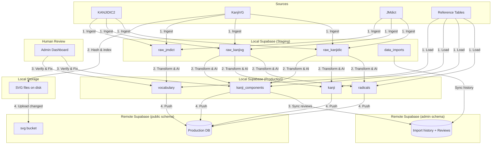

# Content Pipeline Orchestration

## Overview

The Content Pipeline transforms raw open-source dictionary data (KANJIDIC2, KanjiVG, JMdict) and reference datasets (JLPT mappings, JmdictFurigana) into structured, verified educational content used by the app. It follows a **Local-First, Human-in-the-Loop** architecture.

The pipeline runs entirely in the **Local Environment** (Local Supabase + Admin Tool). Only verified, production-ready data is synced to the **Remote Production** database.

**Stateless Admin:** The local database is an ephemeral cache — it can be rebuilt from source files and Remote admin state at any time. If the admin loses the local DB (new device, crash), no work is lost:

- **Idempotent ingestion:** same source file + version → same raw data
- **Idempotent transformation:** same raw data + same logic → same entities
- **Review decisions** and **import history** live in the Remote `admin` schema, not locally
- Raw and generated tables are local-only and disposable

## Source Archives

Immutable source data lives in `sources/` at the project root. Each folder is a versioned snapshot — never modified after download.

### 1. Kanji Source (Official XML) — `kanjidic-{date}/`

Downloaded from the [EDRDG](http://www.edrdg.org/wiki/KANJIDIC_Project.html) project. The official KANJIDIC2 XML contains every field (meanings in all languages, classical radicals, nanori, variants, dictionary refs) in a single file.

| Archive | Contents | Pipeline target |
|---|---|---|
| `kanjidic2.xml.gz` | Full KANJIDIC2 dictionary (~13,000 entries) | `raw_kanjidic` → `kanji`, `kanji_i18n`, `kanji_readings` |

Single-pass ingestion: meanings are grouped by `m_lang` attribute (EN, ES, FR, etc.) into the `raw_kanjidic.meanings` JSONB column.

### 2. Vocabulary Source (Official XML) — `jmdict-{version}/`

Downloaded from the [EDRDG](http://www.edrdg.org/wiki/JMdict-EDICT_Dictionary_Project.html). The official JMDict XML contains all vocabulary entries with readings, senses, and cross-references.

| Archive | Contents | Pipeline target |
|---|---|---|
| `JMdict.gz` | Full JMDict dictionary (~200,000 entries, all languages) | `raw_jmdict` → `vocabulary`, `vocabulary_i18n`, `vocabulary_readings` |
| `JMdict_e_examp.gz` | English JMDict + example sentence pairs from the Tanaka Corpus | `vocabulary_sentences` (en) |

### 3. Visual Source (KanjiVG) — `kanjivg-{version}/`

Downloaded from the [KanjiVG](https://kanjivg.tagaini.net/) project. Stroke order and component decomposition data.

| Archive | Contents | Pipeline target |
|---|---|---|
| `kanjivg-{version}.xml.gz` | Single XML with all kanji stroke/component data (~6,700 entries) | `raw_kanjivg` → `radicals`, `kanji_components` |
| `kanjivg-{version}-main.zip` | Individual SVG files per kanji (stroke diagrams) | `radicals` (SVG assets), `radical_variants` |

### 4. JLPT Level Mapping — `jlpt_mapping/`

Curated kanji-to-JLPT-level mapping compiled from Jonathan Waller's [Tanos](https://www.tanos.co.uk/jlpt/) lists and David Luz Gouveia's [kanji-data](https://github.com/davidluzgouveia/kanji-data) repo.

| File | Contents | Pipeline target |
|---|---|---|
| `jlpt_mapping.csv` | 2,211 kanji → N1–N5 level | `source_jlpt_levels` |

No version suffix — single curated file, updated manually. Not tracked in `data_imports`. Loaded via TRUNCATE + INSERT during pipeline setup (see [jlpt_mapping_format.md](../sources/jlpt_mapping_format.md)).

### 5. JLPT Vocabulary Mapping — `jlpt_vocab_mapping/`

Curated vocabulary-to-JLPT-level mapping compiled from Jamie Sinclair's [Open Anki JLPT Decks](https://github.com/jamsinclair/open-anki-jlpt-decks), originally derived from Jonathan Waller's [Tanos](https://www.tanos.co.uk/jlpt/) word lists.

| File | Contents | Pipeline target |
|---|---|---|
| `n1.csv` through `n5.csv` | 8,131 vocabulary → N1–N5 level (one file per level) | `source_vocab_levels` |

No version suffix — curated files, updated manually. Not tracked in `data_imports`. Loaded via TRUNCATE + INSERT during pipeline setup (see [jlpt_vocab_mapping_format.md](../sources/jlpt_vocab_mapping_format.md)).

### 6. Furigana Mapping — `jmdictfurigana-{semver}+{date}/`

Pre-computed per-character furigana mappings from [Doublevil's JmdictFurigana](https://github.com/Doublevil/JmdictFurigana). Auto-rebuilt monthly from the latest JMdict and KANJIDIC releases.

| Archive | Contents | Pipeline target |
|---|---|---|
| `JmdictFurigana.json.tar.gz` | 230,371 word → furigana segment mappings | `jmdict_furigana` |

Uses semantic versioning with a build date suffix (e.g. `jmdictfurigana-2.3.1+20260125/`). Tracked in `data_imports` (like JMdict) because the dataset is tightly coupled with JMdict — both should be updated together when a new JMdict snapshot is released. See [jmdict_furigana_format.md](../sources/jmdict_furigana_format.md).

### Source Strategy Summary

| Source | Files | Languages | Strategy |
|---|---|---|---|
| Kanji | 1 XML (`kanjidic2.xml.gz`) | All (filtered to target languages during transformation) | Single pass, meanings grouped by `m_lang` |
| Vocabulary | 2 XML (`JMdict.gz` + `JMdict_e_examp.gz`) | All (filtered to target languages during transformation) | Two-pass: dictionary then examples |
| KanjiVG | 1 XML + 1 SVG ZIP | N/A | Single pass |
| JLPT Mapping | 1 CSV (`jlpt_mapping.csv`) | N/A | TRUNCATE + INSERT reference table |
| JLPT Vocab Mapping | 5 CSV (`n1.csv`–`n5.csv`) | N/A | TRUNCATE + INSERT reference table, level from filename |
| JmdictFurigana | 1 JSON tarball (`JmdictFurigana.json.tar.gz`) | N/A | Tracked in `data_imports`, coupled with JMdict |

### Folder Preparation

The admin prepares source data by placing downloaded archives into correctly named folders under `sources/`. The pipeline operates on **folders, not individual files** — the admin selects a source folder, and the program validates its contents automatically.

**Required folder naming:**

| Source | Folder pattern | Example |
|---|---|---|
| KANJIDIC | `kanjidic2-{version}/` | `kanjidic2-20260208/` |
| JMDict | `jmdict-{version}/` | `jmdict-20260207/` |
| KanjiVG | `kanjivg-{version}/` | `kanjivg-20250816/` |
| JLPT Mapping | `jlpt_mapping/` (no version) | `jlpt_mapping/` |
| JLPT Vocab Mapping | `jlpt_vocab_mapping/` (no version) | `jlpt_vocab_mapping/` |
| JmdictFurigana | `jmdictfurigana-{semver}+{date}/` | `jmdictfurigana-2.3.1+20260125/` |

The `{version}` segment becomes the `source_version` value in `data_imports`. Reference tables (JLPT mapping, JLPT vocab mapping) are not tracked in `data_imports` — they are static curated files with no version lifecycle. JmdictFurigana **is** tracked because it is rebuilt monthly from JMdict and must stay in sync.

**Required folder contents:**

| Source | Required files | Optional files |
|---|---|---|
| KANJIDIC | `kanjidic2.xml.gz` | — |
| JMDict | `JMdict.gz`, `JMdict_e_examp.gz` | — |
| KanjiVG | `kanjivg-{version}.xml.gz` | `kanjivg-{version}-main.zip` (SVGs, used in Phase 2) |
| JLPT Mapping | `jlpt_mapping.csv` | — |
| JLPT Vocab Mapping | `n1.csv`, `n2.csv`, `n3.csv`, `n4.csv`, `n5.csv` | — |
| JmdictFurigana | `JmdictFurigana.json.tar.gz` | — |

**Pre-ingestion validation:** Before any parsing begins, the pipeline runs a validation step that checks:
1. Folder name matches the expected pattern for the selected source.
2. All required files are present in the folder.
3. No active (non-terminal) import exists for this source.

If validation fails, the pipeline reports what is missing or incorrect and does not proceed. See [ingestion.md](ingestion.md) for the full set of correctness invariants.

## Architecture



## Hydration (New Device Workflow)

When an admin starts fresh (new device, wiped DB, crash recovery), the local DB is rebuilt from source files and Remote admin state:

1. **Login** — admin authenticates with Supabase. The app pulls `data_imports` and `kanji_component_reviews` from the Remote `admin` schema.
2. **Supply source files** — admin places the same source archives into `sources/`. Re-parse into raw tables (idempotent — same file + version = same rows). Load reference tables: `source_jlpt_levels` (kanji JLPT mapping), `source_vocab_levels` (vocabulary JLPT mapping), `jmdict_furigana` (furigana segments).
3. **Run transformation** — rebuild production tables from raw data (idempotent — same raw + same logic = same entities).
4. **Apply saved reviews** — merge downloaded review decisions onto the locally regenerated `kanji_component_reviews` rows.
5. **Resume work** — the admin is back to where they left off. No data was lost.

## Phase 1: Ingestion (Raw Staging)

**Goal:** Load external file data into queryable SQL tables without data loss. See [ingestion.md](ingestion.md) for the correctness invariants the ingestion layer must enforce.

### 1.1 Version Tracking

Before parsing, create a new `data_imports` row to track this batch.

| Field | Value |
|---|---|
| `source` | `kanjidic`, `kanjivg`, `jmdict`, or `jmdict_furigana` |
| `source_version` | e.g. "2024-04-01" |
| `status` | `pending` |

See [data_import.md](../entities/data_import.md).

### 1.2 Parsing & Insertion

Dart parsers running inside the Admin Tool parse source files and insert rows into `raw_kanjidic` / `raw_kanjivg` / `raw_jmdict`.

- **Kanji (XML):** Single Dart pass on `kanjidic2.xml`. Groups all `<meaning>` tags by `m_lang` attribute into `raw_kanjidic.meanings` JSONB column (EN, ES, etc. in one pass). Gzip decompression via `dart:io` `GZipCodec`.
- **KanjiVG (XML):** Single Dart pass on `kanjivg-{version}.xml` for stroke paths and component trees. Gzip decompression via `dart:io` `GZipCodec`.
- **Vocabulary (XML):** Single Dart pass on `JMdict.gz` for vocabulary entries with readings and senses. Gzip decompression via `dart:io` `GZipCodec`. All languages are stored in raw tables; filtering to supported languages happens during transformation (Phase 2).
- **JLPT Kanji Mapping (CSV):** Load `sources/jlpt_mapping/jlpt_mapping.csv` into `source_jlpt_levels` via TRUNCATE + INSERT. Not tracked in `data_imports` — this is a simple reference table with no version lifecycle. See [jlpt_mapping_format.md](../sources/jlpt_mapping_format.md).
- **JLPT Vocabulary Mapping (CSV):** Load `sources/jlpt_vocab_mapping/n1.csv` through `n5.csv` into `source_vocab_levels` via TRUNCATE + INSERT. Level is derived from the filename (not from tags in the CSV). Duplicates across files resolved by keeping the easiest level. See [jlpt_vocab_mapping_format.md](../sources/jlpt_vocab_mapping_format.md).
- **JmdictFurigana (JSON):** Decompress `JmdictFurigana.json.tar.gz`, strip BOM, parse the JSON array, and insert into `jmdict_furigana` under the current `import_id`. Each entry maps a `(text, reading)` pair to a list of `ruby`/`rt` furigana segments. Tracked in `data_imports` (source = `jmdict_furigana`) because the dataset is coupled with JMdict and should be updated in lockstep. See [jmdict_furigana_format.md](../sources/jmdict_furigana_format.md).

Common rules:
- Every row carries the `import_id` from step 1.1.
- **Conflict strategy:** Insert new rows under the new `import_id`. Old import versions are preserved for diffing.
- Batch insert in chunks of 500 rows via repository.
- On success: set `data_imports.status` = `ingested`, populate `record_count`.
- On failure: set `status` = `failed`, populate `error_message`.

See [raw_kanjidic.md](../entities/raw_kanjidic.md), [raw_kanjivg.md](../entities/raw_kanjivg.md).

## Phase 2: Transformation (Raw → Local Production)

**Goal:** Convert raw dictionary data into app entities (Radical, Kanji, KanjiComponent).

**Target languages:** Transformation accepts a list of target language codes (defaults to `['en', 'es']`). Only `*_i18n` rows for the target languages are created or updated. Existing `*_i18n` rows for other languages are left untouched. This means a new language can be added later by re-running transformation with just that language — without re-ingesting or modifying already-processed languages.

### 2.1 The Processor

A Dart/SQL logic layer (triggered via Admin Tool) processes the active `import_id`. Set `data_imports.status` = `processing`.

### 2.2 Radical Extraction

**Scope:** Only `raw_kanjivg` entries whose character has a JLPT level (via `source_jlpt_level_entries`) or a school grade (via `raw_kanjidic.grade`) are processed. See [radical_extraction.md §Scope](radical_extraction.md#scope-jlptgrade-kanji-only).

**Ghost flattening:** Not every KanjiVG component becomes a radical. The pipeline builds a **keep set** (learnable kanji + official Kangxi radicals + components appearing in 3+ in-scope kanji) and flattens non-keep-set intermediates ("ghost radicals") by replacing them with their own children. This reduces the radical set from ~985 (scope-only) to ~350–450 meaningful building blocks. See [radical_extraction.md §Keep Set](radical_extraction.md#keep-set-what-becomes-a-radical) and [§Ghost Flattening](radical_extraction.md#ghost-radical-flattening).

1. Build scope set from `raw_kanjidic` (grade) + `source_jlpt_level_entries` (JLPT).
2. Build keep set: scope set ∪ official Kangxi radicals ∪ high-frequency components (≥3 in-scope kanji).
3. Scan in-scope entries with ghost flattening — resolve effective children, collect radical candidates.
4. Upsert into `radicals` table. Parse `position` and `variant`/`original` attributes to populate `radical_variants`.

See [radical.md](../entities/radical.md), [radical_extraction.md](radical_extraction.md).

### 2.3 Kanji & Component Composition

1. **Kanji creation:** Create `draft_kanji` rows using metadata from `raw_kanjidic` (stroke count, grade, frequency, JLPT mapping). Create `draft_kanji_i18n` rows from `raw_kanjidic.meanings` for all languages present in the raw data — target language filtering is applied during AI enrichment and promotion.
2. **Component linking:** Resolve effective children per kanji (after ghost flattening), resolve each child to its master radical, and create `kanji_components` rows. Then derive radical metadata (`impact_score`, `min_grade`, `min_jlpt_level`) from the links.

See [kanji_composition.md](kanji_composition.md), [component_linking.md](component_linking.md).

### 2.4 SVG Processing & Hashing

After radicals and kanji are created, the pipeline processes SVG files from the `kanjivg-{version}-main.zip` archive.

1. **Extract SVGs:** Unzip individual SVG files from the archive into a local working directory.
2. **Compute `svg_hash`:** For each SVG file, compute `SHA-256` of the raw file bytes and store the hex digest. This hash is content-based — identical SVG bytes always produce the same hash regardless of source version.
3. **Populate fields:** For each `radicals` and `radical_variants` row, set:
   - `svg_file_name` — Unicode hex filename, e.g. `06c34.svg` (see [supabase.md](supabase.md#file-naming))
   - `svg_hash` — the SHA-256 hex digest from step 2
   - `svg_file_url` — constructed from the bucket URL pattern: `{supabase_url}/storage/v1/object/public/svg/{svg_file_name}`
4. **Populate kanji SVGs:** Same process for `kanji` rows — each kanji has its own SVG from the same archive.

**Hash stability:** If a new KanjiVG version ships identical bytes for a given character, the hash stays the same. Only characters with actual SVG changes get a new hash. This enables efficient delta uploads during promotion (Phase 4).

### 2.5 Vocabulary Extraction

JMdict data is processed separately from the KanjiVG/KANJIDIC pipeline, using three additional reference tables loaded during Phase 1: `source_vocab_levels` (JLPT word levels), `jmdict_furigana` (per-character furigana mappings), and the `kanji` table (for FK resolution).

**From `raw_jmdict` + reference tables:**
1. **Vocabulary creation:** Select common words (priority-flagged or in `source_vocab_levels`) and upsert `vocabulary` rows using `ent_seq` as the stable ID. Resolve `min_jlpt_level` from `source_vocab_levels` (authoritative) with fallback to `MAX(kanji.min_jlpt_level)` across constituent kanji.
2. **Segmentation:** Construct `segments` JSONB using `jmdict_furigana` data — map each `ruby`/`rt` pair to a VocabularySegment with `kanji_id`/`kanji_ids` resolved from the `kanji` table. Jukujikun entries (multi-kanji `ruby`) produce segments with `kanji_ids` (list) instead of `kanji_id` (single).
3. **Readings:** Extract readings into `vocabulary_readings` with primary/secondary priority based on `re_pri` matching.
4. **Localized meanings:** Insert `vocabulary_i18n` rows for each target language from `raw_jmdict.senses.glosses`.

**From `raw_jmdict.examples` (Tanaka Corpus):**
5. **Example sentences:** Extract sentence pairs into `vocabulary_sentences` with `original_text` and `verification_status = 'verified'` (source data is trustworthy). Insert the English translation into `vocabulary_sentence_i18n` with `lang_code = 'en'`.

**Post-processing:**
6. **Kanji linking:** For each word, scan the string to find known kanji from the `kanji` table. Insert `vocabulary_kanji` rows with `kanji_id` and `position` (0-based index). Orphan kanji (not in the `kanji` table) are logged but the word is still imported (permissive approach — unlinked kanji render as "ghosts").

**Ordering constraint:** Vocabulary extraction must run after kanji creation (2.3), because `vocabulary_kanji` and segment `kanji_id` references require the `kanji` table. Reference tables (`source_vocab_levels`, `jmdict_furigana`) must be loaded during Phase 1.

See [vocabulary_extraction.md](vocabulary_extraction.md) for the full algorithm, [vocabulary.md](../entities/vocabulary.md) for the entity spec.

### 2.6 AI Enrichment

Combines algorithmic logic hint estimation with AI-assisted content generation (mnemonics, translations, furigana annotation). This phase has two sub-phases:

- **Sub-phase A (Automated):** Estimates `logic_hint` (semantic vs phonetic) for every `kanji_component` using onyomi matching. Creates `kanji_component_reviews` rows with `verification_status = draft` and `ai_confidence` scores.
- **Sub-phase B (Manual CSV workflow):** Exports content to CSV files for enrichment via chat-based AI tools (no programmatic API access). Five batch types cover radical mnemonics, kanji mnemonics, sentence translation, furigana annotation, and vocabulary mnemonics.

All AI-generated artifacts require human review (Phase 3) before remote sync.

On completion: set `data_imports.status` = `processed`, populate `processed_at`.

See [ai_enrichment.md](ai_enrichment.md) for the full algorithm, CSV formats, validation rules, and batch specifications.

## Phase 3: Verification (Human-in-the-Loop)

**Goal:** Ensure AI guesses and raw data errors do not reach end users.

### 3.1 Verification Status

Entities that require human review use the `verification_status` enum:

| Status | Description |
|---|---|
| `draft` | Newly generated by the transformation layer. Not ready for remote sync |
| `verified` | Confirmed by human review (or high-confidence auto-rule). Ready for remote sync |
| `flagged` | Identified as problematic/error. Excluded from sync |

This status is tracked in two places:
- **`kanji_component_reviews`** — separate 1:1 table for component review metadata (`ai_confidence`, etc.). See [kanji_component.md](../entities/kanji_component.md).
- **`vocabulary_sentences.verification_status`** — column directly on the sentence row (option A: simpler than a separate review table since sentences only need a status flag). See [vocabulary.md](../entities/vocabulary.md).

### 3.2 Review Queue (Admin Dashboard)

The Admin Tool queries `kanji_component_reviews JOIN kanji_components` where `verification_status = 'draft'`, ordered by `ai_confidence ASC` (least confident first).

**Review UI:**
- Visual diff: kanji and component shown side-by-side.
- Reading comparison: radical onyomi vs kanji onyomi displayed for phonetic verification.
- Actions: "Confirm Phonetic", "Switch to Semantic", "Flag for Review", "Mark Verified".

### 3.3 Batch Verification

High-confidence matches (e.g. `ai_confidence >= 0.95`) can be auto-verified in bulk via an admin action, reducing manual review volume. The threshold is configurable.

### 3.4 Sentence Review Queue

The Admin Tool queries `vocabulary_sentences` where `verification_status = 'draft'`, primarily AI-translated Spanish sentences.

**Review UI:**
- Side-by-side: English source sentence (from `vocabulary_sentence_i18n`) vs AI-generated Spanish translation.
- The Japanese `original_text` is rendered with `[kanji](reading)` furigana for context.
- Actions: "Edit Translation", "Confirm", "Reject".

**Batch action:** "Approve all" can be used with caution for bulk verification. Unlike component reviews (which have `ai_confidence` scores), sentence reviews rely on human judgement of translation quality.

## Phase 4: Remote Sync (Release Builder)

**Goal:** Selectively push subsets of verified content (e.g. "N5 only") and handle version updates without full re-syncs.

### 4.1 Comparison-Based Sync

The Release Builder uses **comparison-based sync** — it queries Remote Production at push time and compares against local state. No sync-tracking columns exist on local tables (the local DB is ephemeral; see Stateless Admin above).

**How it works:**

1. The Release Builder queries Remote Production for all IDs + `updated_at` within the selected scope (e.g. all N5 kanji).
2. It compares each local row against the remote result:
   - **New** — local row has no match on Remote → upsert
   - **Updated** — local `updated_at` is newer than remote → upsert
   - **Unchanged** — timestamps match → skip
3. After push: no local state to update (stateless).

**Dependency propagation:** When a child entity (`kanji_i18n`, `kanji_readings`, `kanji_components`, `vocabulary_i18n`, `vocabulary_readings`, `vocabulary_sentences`) is inserted or modified, the parent entity's `updated_at` is automatically bumped via triggers. This ensures the parent surfaces as "updated" in the comparison so the Release Builder picks it up with the new child data.

### 4.2 Safety Gates

Before an item is eligible for sync, it must pass verification checks:

- **`kanji_components`:** only rows with `kanji_component_reviews.verification_status = 'verified'` are synced.
- **`vocabulary`:** sync only rows whose **all** constituent kanji (via `vocabulary_kanji`) already exist on the Remote DB. This prevents FK violations for words containing kanji from an unfinished or failed import.
- **`vocabulary_sentences`:** only rows where `verification_status = 'verified'` are synced. English source sentences (born `verified`) sync immediately. AI-translated sentences (born `draft`) sync only after human review.

### 4.3 The Release Builder (Admin UI)

Instead of a "Sync All" button, the Admin Tool provides a **Release Builder** to define the scope of each push.

**1. Scope selection (filters):**

| Filter | Options | Example |
|---|---|---|
| Primary | All, New items only, Updates only | "New items only" for initial launch |
| Grade | 1–6, Secondary, All | "1–2" for MVP |
| JLPT | N5–N1, All | "N5" for first release |
| Language | Target languages to include | "es" to push only items with Spanish translations |

**2. Diff preview:** The system compares local rows against Remote Production and shows a summary:

Result: "Ready to release: 120 new words, 5 updated words, 800 unchanged (skipped)."

**3. Execution (the push):**

1. **SVG sync** — upload dirty SVGs first (hash-based diff, see 4.4).
2. **Batch upsert** — push the selected rows to Remote in FK dependency order (see 4.5).
3. **URL rewrite** — replace the local base URL in `svg_file_url` with the Remote Production Storage URL (e.g. `https://<project-ref>.supabase.co/storage/v1/object/public/svg/...`). Do not sync localhost URLs to production.
4. **Completion** — log push results. No local state to update (stateless).

**Result:** Users get vocabulary words with definitions and readings immediately. English example sentences arrive with the word. AI-translated sentences arrive only after admin approval.

### 4.4 SVG Upload

Before syncing database rows, upload changed SVG files to the remote `svg` bucket so that `svg_file_url` values are valid when clients receive them.

1. **Diff by hash:** For each `radicals`, `radical_variants`, and `kanji` row being synced, compare local `svg_hash` against the remote row's `svg_hash` (if it exists).
2. **Upload changed files:** Only upload SVGs where the hash differs or the remote row is new. Use `supabase.storage.from('svg').upload()` with upsert mode.
3. **Skip unchanged:** Identical hashes mean identical bytes — no upload needed. On a typical version bump, most SVGs are unchanged, so this keeps sync fast.

**Failure handling:** If an SVG upload fails, the sync for that entity is skipped and logged. The database row is not synced without its SVG — this prevents clients from receiving a `svg_file_url` that 404s.

### 4.5 Sync Order (FK Dependency Resolution)

Tables must be synced in strict order to satisfy foreign key constraints:

1. **radicals** — root entities (includes `radical_i18n`, `radical_variants`)
2. **kanji** — depends on nothing directly (includes `kanji_i18n`, `kanji_readings`)
3. **kanji_components** — depends on both `radicals` and `kanji`
4. **vocabulary** — depends on `kanji` (includes `vocabulary_i18n`, `vocabulary_readings`, `vocabulary_kanji`, `vocabulary_sentences`, `vocabulary_sentence_i18n`)

The sync script validates parent existence on Remote before upserting children.

### 4.6 Scenarios

**Source update (e.g. new KANJIDIC version):**
1. Ingest new `raw_kanjidic` rows.
2. Transformation updates existing `kanji` rows — `updated_at` bumps automatically.
3. Changed items appear in the "Updates only" filter of the Release Builder.
4. Admin reviews and pushes as a maintenance patch.

**Adding a new language (e.g. French):**
1. Run transformation with `target_languages=['fr']`.
2. New `kanji_i18n` (fr) and `vocabulary_i18n` (fr) rows are inserted.
3. Dependency propagation bumps parent `updated_at` on each affected `kanji`/`vocabulary` row.
4. Admin opens Release Builder, sees dirty items, pushes — Remote receives the parent rows with their new French child data.

### 4.7 Post-Sync

Remote app clients receive updates via their standard sync mechanism (see [offline.md](offline.md)).

## Pipeline Status Lifecycle

```
pending → ingested → processing → processed
   ↓         ↓           ↓
 failed    failed      failed
```

Each transition updates the corresponding timestamp on `data_imports`. See [data_import.md](../entities/data_import.md) for the full status enum.

## Commands

```bash
# Phase 1: Ingest raw data (Dart parsers via Admin Tool)
flutter run -d macos --target lib/pipeline/ingest_kanji.dart
flutter run -d macos --target lib/pipeline/ingest_kanjivg.dart

# Phase 2: Run transformation (via Admin Tool or CLI)
# Triggered from Admin Dashboard UI

# Phase 3: Review
# Done interactively via Admin Dashboard

# Phase 4: Promote to remote
# Triggered from Admin Dashboard after review is complete
```

## Warning Pattern

All extraction phases use the `Warning` class (`apps/admin/lib/domain/entities/warning.dart`) to surface issues during pipeline execution. Warnings are collected per phase and displayed in the Admin Tool's phase cards.

```dart
enum WarningSeverity { low, high }

class Warning {
  const Warning(this.message, {this.severity = WarningSeverity.low});
  final String message;
  final WarningSeverity severity;
}
```

**Severity guidelines:**

| Severity | When to use | Admin action |
|---|---|---|
| `high` | Learner-facing content gap or data integrity violation — an item in a JLPT study path is missing data, or a prerequisite invariant is broken | Investigate before promotion |
| `low` | Informational — expected data gaps for rare/ungraded characters, or non-critical quality notes | Review at leisure |

**JLPT-aware severity:** Many conditions use a two-tier pattern — `high` if the affected entity is JLPT-mapped (will appear in a study path), `low` otherwise. This ensures admin attention focuses on learner-visible content.

Each phase's dedicated doc contains a **Warnings** section with a table listing all conditions, their severity, and rationale. See [radical_extraction.md](radical_extraction.md), [kanji_composition.md](kanji_composition.md), [component_linking.md](component_linking.md), [svg_processing.md](svg_processing.md), [vocabulary_extraction.md](vocabulary_extraction.md).

## Related Docs

- [ingestion.md](ingestion.md) — Phase 1 correctness invariants, known gaps, and recovery procedures
- [radical_extraction.md](radical_extraction.md) — Passes 1–2 radical/variant registration
- [kanji_composition.md](kanji_composition.md) — kanji creation from KANJIDIC2
- [component_linking.md](component_linking.md) — component linking and radical metadata derivation
- [vocabulary_extraction.md](vocabulary_extraction.md) — vocabulary extraction from JMdict (Phase 2.5)
- [ai_enrichment.md](ai_enrichment.md) — AI enrichment: logic hints, mnemonics, translations, furigana (Phase 2.6)
- [data_import.md](../entities/data_import.md) — import tracking entity
- [raw_kanjidic.md](../entities/raw_kanjidic.md) — KANJIDIC2 staging table
- [raw_kanjivg.md](../entities/raw_kanjivg.md) — KanjiVG staging table
- [raw_jmdict.md](../entities/raw_jmdict.md) — JMdict staging table
- [kanji_component.md](../entities/kanji_component.md) — component entity and KanjiComponentReview (admin review state)
- [radical.md](../entities/radical.md) — radical extraction target
- [kanji.md](../entities/kanji.md) — kanji creation target
- [vocabulary.md](../entities/vocabulary.md) — vocabulary extraction target
- [jlpt_mapping_format.md](../sources/jlpt_mapping_format.md) — JLPT kanji mapping CSV format
- [jlpt_vocab_mapping_format.md](../sources/jlpt_vocab_mapping_format.md) — JLPT vocabulary mapping CSV format
- [jmdict_furigana_format.md](../sources/jmdict_furigana_format.md) — JmdictFurigana JSON format
- [offline.md](offline.md) — client-side sync after promotion
- [supabase.md](supabase.md) — database infrastructure
